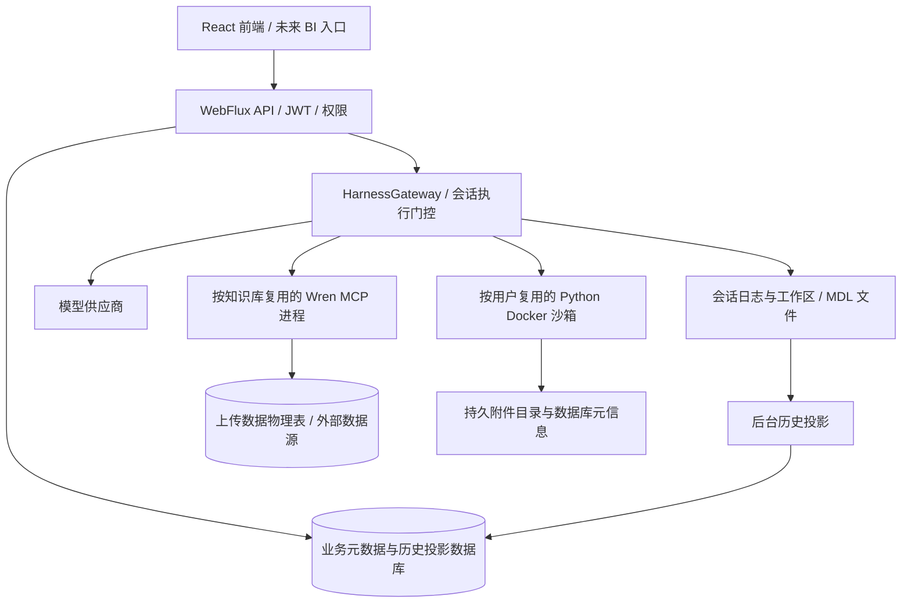

# DataAgent 上线准备审查（2026-10-09）

## 结论与范围

基于 `data-agent-multiAgent-Mdl-lyf` 的代码审查，当前架构适合继续完善为公司内网、少量并发用户的单实例服务，无需先引入 Kubernetes、对象存储或拆分微服务。但目前不能仅复制开发配置到 Linux 就判定满足上线条件。

已有基础：历史列表走本地数据库并分页；Python 沙箱按需创建、按用户复用、按会话目录隔离；附件独立保存并校验当前用户、限制容量；聊天工具事件按请求隔离；数据源支持保存前试连。上述能力降低了常规页面对 Docker 的依赖，也使容器回收与历史附件保存可以分开处理。

本文是审查与排期建议，不代表新增能力已经实现。Wren 问数与建模核心算法仍由同事负责；这里涉及 Wren 的内容限于进程数量、等待和发布依赖。知识库共享、BI 身份及此前暂缓事项继续等待讨论。

## 当前架构及状态边界

需要区分四类状态：业务元数据、可展示的历史、分析输入/附件、正在执行的 Agent 状态。数据库里能展示历史，不等于服务重启后能恢复正在等待确认的建模操作；附件仍在，也不等于 Python 内存变量仍在。运行中的流连接与部分注册表仍属于单进程状态。

## 首次发布前优先处理

| 优先级 | 已确认的问题与代码依据 | 建议的最小改造 / 验收 |
|---|---|---|
| P0 | `application.yml` 保留开发 JWT 默认密钥、数据库默认凭证及模型 API Key 形式的非空默认值；`JwtService` 拒绝的开发密钥常量与配置默认值不一致，短密钥还会补零 | 增加生产启动校验，生产必须环境注入密钥和凭证；拒绝已知开发密钥及不足长度的密钥。仓库中的模型密钥若有效，需要轮换；本次未验证其有效性 |
| P0 | `JpaUserStore.seedDefaultAdmin()` 在没有 admin 时创建 `admin/admin`；关闭 SQL 初始化不关闭这段 Java 初始化 | 开发示例与生产管理员初始化分离，生产禁止默认密码；新库启动和现有库升级均验收 |
| P1 | 默认 `ddl-auto=update`、SQL 初始化 `always`，未见版本化数据库迁移机制 | 建立版本迁移及初始建库脚本，生产 `validate` 需在迁移完成后使用；记录已有开发库的迁移基线，避免重复建表与示例数据写入 |
| P1 | `AuthController` 中 JPA/密码校验的 `Mono.fromCallable` 没有切换工作线程；`ChatController.stream` 在构造流之前同步执行权限查询 | 审查所有 API 的 JDBC、文件及进程调用，移出 Netty I/O 线程；记录线程名和接口耗时，确认慢数据库不拖住无关页面 |
| P1 | 默认 `LocalSessionTurnGate` 使用阻塞式 `Semaphore.acquire()`，会等待而不是抛 `TurnBusyException`；未见主问答的全局并发上限 | 为同会话重复执行设置明确的拒绝或有界等待；限制全局/每用户昂贵任务并发和排队时间，前端显示排队或繁忙。不能因 gateway 有 busy catch 就认为默认门控已快速拒绝 |
| P1 | `WrenInstanceRegistry` 按知识库保留进程，没有全局实例数量上限；同库调用门控串行，客户端关闭可能等待 10 秒 | 与同事协商进程预算、同库等待上限及运行中租约；空闲回收与关闭超时不得长期阻塞统一回收线程。这是生命周期治理，不改变问数算法 |
| P1 | 历史、元数据、数据物理表、MDL、附件分散在数据库及文件目录 | 在已有备份说明基础上补实际恢复演练：在独立目录/数据库恢复，核对历史显示、附件下载、建模与再次问答；明确恢复点、允许丢失时间及恢复时间 |
| P1 | 没有完整的当前版本 Linux 发布包、服务管理及代理验收闭环；旧集群文档承诺超过代码实际能力 | 首次采用单 Linux 应用实例，完成 systemd、反向代理、持久目录、升级/回退、日志与监控。集群方案先视为目标设计 |

以上是代码路径发现的问题，尚未通过线上延迟测量确认它们各自占用多少时间。修复优先级应结合使用人数和上线窗口调整，但开发默认密钥与默认管理员应先消除。

## 保留为待讨论的改进

这些事项仍遵循 [TODO](TODO.md)，没有在本次审查中默认获得实施确认。

### 身份、知识库共享与凭证（此前第 2 项及 ADR 0050）

- 当前 JWT 的角色来自签发时内容，用户删除、禁用、角色变更和退出后的令牌失效策略需要确定。
- CORS 当前允许任意来源模式且允许凭证；接入 BI 后应配置明确的受信来源。BI 的用户身份应由后端验证并映射稳定 userId，不能依靠前端传用户名作为认证。
- 当前知识库仍以私有归属为主。后续需要 QUERY/EDIT 权限、管理员边界、撤权后历史/附件规则；隐藏按钮不替代后端校验。
- 数据源密码在数据库及生成的 Wren profiles 文件中可出现明文。凭证加密方案暂缓期间，至少需要限制数据库、配置文件与备份的运维访问权限。
- 嵌入模式只展示用户名可以保留；独立运行模式的退出/账户管理入口应在身份方案确定时一起明确。

### 历史与容量（此前第 6 项、保留周期）

`SessionHistoryService` 的后台投影已分批处理，但发生变化的会话仍整文件读取和解析，并读取已有消息进行比较。长会话每轮成本会增长；后续可记录读取偏移并对重写/损坏回退。历史列表分页已经落地，不需要再次把列表变为逐会话访问 Docker。

`SessionHistoryRepository` 的查询包含 gateKey 子串判定和联表排序；当前索引是否有效，需要在真实数据上做 EXPLAIN。优先根据访问条件调整持久字段与组合索引，不必立即引入搜索引擎。

附件清理已有每轮数量限制和容量约束，不能概括成每次请求遍历全部目录。当前规模可继续本地目录；容量增长后再考虑目录分片和汇总配额计数。历史/附件自动保留周期及删除方式仍需你们确认，不在此设置默认自动删除业务数据。

### 上传与导入（此前第 7 项）

`DatasetController.toBytes()` 对 `FilePart` 使用不带总量上限的 `DataBufferUtils.join`，再复制成字节数组；后面的 Excel 解析流式处理不能消除前面的整文件内存占用。配置中的 Servlet multipart 大小限制不能直接作为当前 WebFlux 上传链路已限制文件大小的证据。

`DatasetImportService` 每次导入启动插入线程池，批次进入无界队列。数据库比解析慢时，会积累批次；多用户导入再放大内存、线程和连接压力。物理表 DDL、批次插入、JPA 元信息和文件保存跨存储，不能只加一个 JPA 事务就获得整体回滚。

建议最小方案为：实际字节计数/落临时文件、限制文件及解压后总量、全局有界导入并发、IMPORTING/READY/FAILED 状态、失败清表/重试补偿。实际限额由业务文件规模决定。

### 会话范围与重启恢复（此前第 8 项）

`ConversationScopeRegistry` 是内存 Map，使用 conversationId 作为键；重启后映射消失。应评估 `(userId, agentId, conversationId)` 的持久范围及每次问答重新鉴权。当前单轮 `DatasetScope` 仍包含用户与知识库范围，不能仅凭 Map 的键就断言已有跨用户泄露。

`DataAgentConfig` 的运行状态默认回退到内存存储。应分别验收已完成历史续聊、执行中重启、等待用户确认时重启；后两者目前不能承诺完整恢复。无需先做复杂任务平台，可以先明确中断状态并允许重新执行。

### 前端维护与首屏（此前第 9 项）

本次生产构建主 JS 约 4.23 MB，gzip 约 1.31 MB，构建器提示大 chunk。后续可将图谱、建模、管理页和重型展示依赖按需加载，逐步拆分 ChatPanel 与统一请求错误处理。内网不能自动消除 JS 下载、解析和首次渲染成本；这与历史 API 是否访问 Docker 是两回事。

## Linux 首次发布方案

### 推荐部署形态

首次使用 **一台 Linux 上的一个 Java 应用实例 + Nginx + Docker 分析沙箱 + 持久 MySQL**。数据库可使用公司已有服务。优先 JAR + systemd，便于固定 Wren Python 环境、Docker daemon 和宿主机文件路径；以后需要容器化应用时再提供应用 Dockerfile 与路径映射方案。仓库当前 sandbox.Dockerfile 是分析沙箱镜像，不等于应用发布镜像。

不建议按现有 cluster-deploy 文档直接开 3 个副本：工具 SSE 总线、沙箱注册表、默认运行状态与部分配额锁仍在单进程内。Redis 配置标志、共享磁盘或者粘性路由各自都不足以证明全链路跨实例可恢复。应用实例共享 Docker 时，还要解决容器标签与孤儿回收的实例归属，防止互相清理。

### 环境与目录约定

| 内容 | 建议路径 / 要求 |
|---|---|
| JAR 发布版本 | `/opt/dataagent/releases/<version>/`，前后端静态资源属于同一制品；固定 Java 17 或经过验证的更高版本 |
| 配置与秘密 | `/etc/dataagent/`，环境配置仅服务账户/运维可读；不得把生产密钥写回仓库 |
| 工作区 | `/var/lib/dataagent/workspace`，通过 `DATAAGENT_WORKSPACE` 显式设置；会话文件由 WorkspaceManager 解析，不能只备份附件 |
| 附件 | `/var/lib/dataagent/artifacts`，通过 `DATAAGENT_ARTIFACTS_DIRECTORY` 设置；与临时沙箱目录分离 |
| MDL 与 Wren profiles | `/var/lib/dataagent/mdl`，通过 `DATAAGENT_WREN_MDL_HOME` 设置；profiles 位于其 `.wren` 子目录，备份同时限制凭证可读性 |
| 服务用户 home / 其他 Agent 状态 | 固定持久 home，检查实际启用的状态存储路径；`agentscope.state.home` 只影响使用该默认路径的实现，不能代替全部工作区配置 |
| Wren Python 环境 | 固定版本的专用 venv，`DATAAGENT_WREN_EXECUTABLE` 使用绝对 Linux 可执行路径；不能复制 Windows venv |
| 日志 | 指定持久日志位置及日志采集；现有 LLM 日志已有轮转，仍需检查详细记录是否包含敏感数据 |

服务以专用账户运行。若使用宿主机 Docker，账户对 daemon 的访问具有宿主机级能力，应仅授予受信后端；分析沙箱内不挂载 Docker socket。应用容器化时必须额外核对 bind mount 的宿主机路径与应用视角路径，不能照搬 JAR 路径。

### 资源预算

当前沙箱默认最多 8 个、每个内存 1 GiB、工作区 tmpfs 512 MiB，并设置 CPU、PID、只读根文件系统和无网络等约束。tmpfs 会占用内存；不要把其上限当作独立磁盘容量，也不要只计算一个用户当前使用的容器。[Docker 资源限制说明](https://docs.docker.com/engine/containers/resource_constraints/)

应按最坏活跃容器集合，再加 JVM、Wren 进程、数据库（如果同机）、OS 和构建之外的运行余量规划内存；CPU 的当前配置在目标 Linux 上是否达到预期限制也要实测。8 个容器不代表最多 8 个耗资源任务：问数、模型调用及导入可能不经过 Python 沙箱。

在 2、5、10 个实际并发用户梯度下记录资源和延迟，再确定 JVM 堆、容器上限、Wren 上限与全局任务并发。本文不提供未经实测的固定机器规格承诺。

### Nginx、连接与发布流程

- 普通 API 和流式问答分别配置。流式路由关闭响应缓冲，并按最大无数据间隔设置 `proxy_read_timeout`；该值是连续读取之间的等待限制，不是简单的整次问答总时长。后续可加 SSE 心跳，避免长工具调用期间连接被代理关闭。[Nginx 官方代理配置](https://nginx.org/en/docs/http/ngx_http_proxy_module.html#proxy_buffering)
- 使用 HTTPS，优先与 BI 同源代理；上传请求大小在代理及后端同时限制。不能仅依靠 Nginx 代替服务端字节计数。
- systemd 管理启动、异常重启和停止等待时间；发布先停止接收新昂贵任务，再处理或标记正在执行的请求。HTTP 断流不一定立即停止阻塞 JDBC/子进程，需单独验证停止语义。
- 构建使用锁文件与固定依赖版本，逐步去除生产制品的 SNAPSHOT、镜像浮动标签和未固定 Python 包。保存制品、配置版本、迁移版本和回退说明。
- 升级前备份并检查数据库迁移兼容性；回退不是只替换旧 JAR，旧代码必须能读取迁移后的库与文件。

## 监控与验收

已有健康接口和工具事件 requestId 可以作为基础，但上线要能回答“慢在哪一步”：记录 HTTP 耗时、执行排队、模型首 token、Wren 等待/冷启动/查询、Python 执行、附件保存的耗时与错误率。同时观察活跃沙箱/Wren 数量、JVM 内存、线程池/连接池、磁盘剩余量。详细 LLM 日志已有轮转，不代表完成了敏感内容治理或端到端链路关联。

健康接口应区分应用存活、可接收业务、组件降级；不要为了每次 readiness 检查就启动全部沙箱与 Wren。Docker 不可用时是否仍允许纯 SQL 问答，应明确为产品行为。

发布环境至少人工/联调验证以下场景：

1. 新环境建库与已有库升级，生产不会生成默认密码账号。
2. 登录、历史分页、知识库列表在 Docker 暂停时的行为。
3. 两个标签页对同会话提问、多个用户同时查询同库、同时导入；等待/拒绝能明确展示。
4. 沙箱回收后历史附件展示、下载，以及恢复分析输入。
5. 查询中停止、刷新断流、应用重启、等待确认时重启，历史状态不会误报完成。
6. 数据库连接失败、磁盘不足、沙箱容量达限、Wren 关闭超时，有可读错误且能再次使用。
7. 经真实 Nginx/BI 入口长时间执行，流式结果及时到达。
8. 在独立环境恢复备份，以及一次可操作的升级/回退演练。

## 本次验证与后续顺序

本次代码提交 `90a3d2ab`：后端 430 项中 418 通过、12 跳过、0 失败；前端 5 项测试通过；前端生产构建及后端 JAR 打包成功。测试中同步修正了之前仍假设沙箱立即创建的旧断言。这些结果不等于 Linux、实际 Docker、真实外部数据库、BI 或浏览器全链路验收；本次没有开展这些联调。

建议顺序：

1. 生产配置、密钥与管理员初始化 → 版本迁移及发布目录。
2. WebFlux 阻塞点 → 请求耗时观测 → 有界问答并发/排队和进程预算。
3. Linux 单实例发布、Nginx 联调、备份恢复与回退演练。
4. 与同事确认共享权限/BI、导入限制、会话范围与保留周期，再逐项更新 ADR/spec 并实现。
5. 根据实际规模安排前端拆包、长会话投影及多实例设计。

本文新增的是排期依据；未自动实施表中未来能力，也未改变已暂缓的决策。
