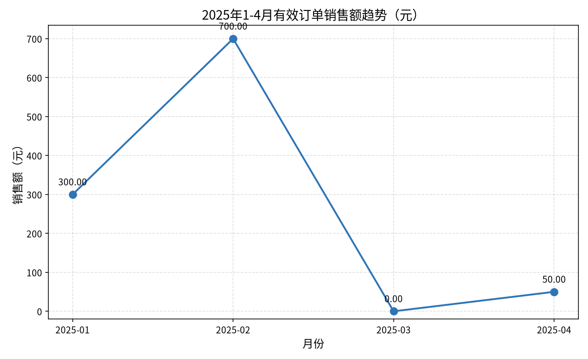

# 沙箱启动后的问数与 Python 实测

日期：2026-10-07。继续使用 bob 的隔离测试知识库 `73b26360-df5c-497e-9137-bdfe7f50df67` 和已发布 MDL v8，没有重建模型或修改业务代码。Docker Server 27.1.1 可用，项目镜像 `agentscope/dataagent-sandbox:latest` 已存在。

## 验证结果

12 道原始问数题全部完成 SSE done，均有真实 Wren 工具调用；11 道最终结果符合原 SQL 基准，1 道存在业务口径歧义。明确该题口径后的追加测试也通过。不能将这组小样本单次结果视为通用准确率或官方 WrenAI agent 对照成绩。

| 用例 | 实际结果 | 判定 |
|---|---|---|
| Q01 有效订单总额 | 1050 元，Cube 查询 | PASS |
| Q02 订单数/付费客户数 | 6 / 2，Cube 查询 | PASS |
| Q03 客户销售额排名 | 李四 700 元、张三 350 元 | PASS |
| Q04 1–4 月含空月份 | 销售额 300、700、0、50；同时给出净营收 230、670、0、50 | PASS，经过年份和月份 JOIN 修复 |
| Q05 2 月有效营收 | 返回净营收 670，基准预期销售额 700 | 口径歧义；原题不匹配 |
| Q06 按订单归属扣成功退款 | 6 行订单明细，合计净营收 950 | PASS |
| Q07 没有有效订单的客户 | customer_id=3，无订单客户 | PASS |
| Q08 商品业务键重复 | P2，2 行 | PASS |
| Q09 一对多金额放大 | 正确 1050，错误 JOIN 累加 1950 | PASS |
| Q10 全量事件聚合 | 10005 行，100.05 元 | PASS |
| Q11 空/缺失客户订单 | 空 1 + 不存在 1 = 2 | PASS，修复歧义列引用后成功 |
| Q12 有效订单平均金额 | 175 元 | PASS |
| Q05 明确“不扣退款”的补测 | 2 月有效订单销售额 700 元 | PASS，独立会话 |

原题运行耗时约 10–23 秒/题。这是本机单次观测，不是性能基准。知识文档包含部分测试数据诊断数值，例如事件行数与金额，所以本轮重点是确认真实 SQL/Cube 结果与最终答案一致；未来盲测应移除答案提示，使用未见数据并固定模型和采样参数。

## Python 文件通道与产物

第一次与问数并行发起的分析请求在多次 Wren 查询后失败，SSE 错误为 `No active sandbox — sandbox filesystem used outside of a call context`，未调用 run_python。Docker 当时已可用，因此这是新的沙箱上下文问题，不能归入旧的引擎未启动。随后等待 12 题完成，单独发起明确销售额口径的分析请求，成功执行两个 run_python：

1. 从真实 Wren 产物 `data/01560e3149c7.csv` 读取，核查 shape/dtypes/head。
2. 再读同一 CSV，生成趋势图和 CSV，计算总额和环比，两次 exit_code 均为 0，没有把结果行写成 Python 字面量。

| 月份 | 销售额（元） | 环比 |
|---|---:|---:|
| 2025-01 | 300 | 空 |
| 2025-02 | 700 | +133.33% |
| 2025-03 | 0 | -100% |
| 2025-04 | 50 | 空，前月基数为 0，不可计算 |

总额 1050 元。通过真实鉴权下载接口获取两份文件，均 HTTP 200；PNG 74762 字节，签名有效；CSV 145 字节，实际读取的四个月金额一致，4 月环比为空。图中中文标题、轴标签和数值经实际图片检查可读；日志有中文 glyph 缺字警告，最终图片未见乱码，仍建议固定字体配置并减少误导性告警。

[下载分析 CSV](wren-gap/artifacts/有效订单销售额趋势_data.csv)。图表的 700 元标注贴近绘图区上边框，可增加 y 轴顶部留白。

## 建议优先级

1. **排查沙箱上下文的偶发失效。** SandboxBackedFilesystem#requireSandbox 依赖 RuntimeContext 中的 SandboxAcquireResult，或旧式字段绑定。首轮失败、顺序补测成功证明问题具有运行条件差异，但还不能证明并发就是根因。需要结合服务异常栈与 call 生命周期，检查 middleware、工具调用和异步回调是否完整传递上下文；复用 harness，不在业务层重新实现沙箱管理。
2. **把口径歧义变成澄清或双结果。** “有效营收”当前可能被解释成销售额或净营收。定义模型指标别名及口径，缺少明确约定时先澄清，或同时输出两个实际数值。不能查询成功就判为用户问题答对。
3. **补齐视图字段描述能力。** 多题调用 wren_describe_model 描述 View 时被拒绝，转而用 SELECT * 探查。为已发布 View 提供列名、类型、单位、粒度、过滤条件和依赖，可减少额外查询及样本截断。
4. **提供数据源方言与月份对齐示例。** 实测出现 MySQL 不支持 STRFTIME、FORMAT 月份 JOIN 全零、字符串 DATE_TRUNC 空结果；最终 SUBSTR(CAST(... AS VARCHAR),1,7) 对齐成功。应将常用年月字段建模为可复用属性，并将数据源方言能力注入问数上下文，减少试错。
5. **处理空结果及全零异常。** 本次 Q04 能探查数据后自行修正，但应建立月份覆盖、聚合总额对照检查，避免把语法可执行但语义错误的空/零结果直接展示。

上一轮发现的关系丢失、前导零导入损失、平台文件预览契约问题依然存在，本次没有修复这些业务代码。

## 原始证据与边界

- `wren-gap/live-Q01-sse.jsonl` 至 `live-Q12-sse.jsonl`：当前 12 题完整工具和回答。
- `live-Q05_explicit-sse.jsonl`、`live-python_sequential-sse.jsonl`：独立补测。
- `live-python-sse.jsonl`：当前并行分析失败证据。
- `sandbox-rerun-evidence.json`：汇总；`sandbox-rerun-judgments.json`：人工核对 SQL 结果和回答后的逐题判定。
- `sandbox-artifact-results.json`：真实文件下载、hash、CSV 内容核对。
- `attempts/20261007-002132/`：上一轮 Docker 引擎未就绪的原始问数失败记录。

官方侧仍只有先前的 CLI/SDK 基线；没有同 LLM 配置的官方 agent 对话实验。本轮验证覆盖后端 SSE、工具执行和实际产物，未进行前端完整浏览器操作验收。没有修改业务代码，未重复运行 Maven/前端构建；既有构建结果见上一轮报告。
